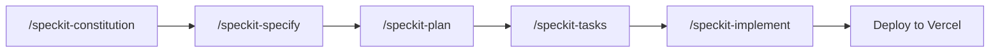
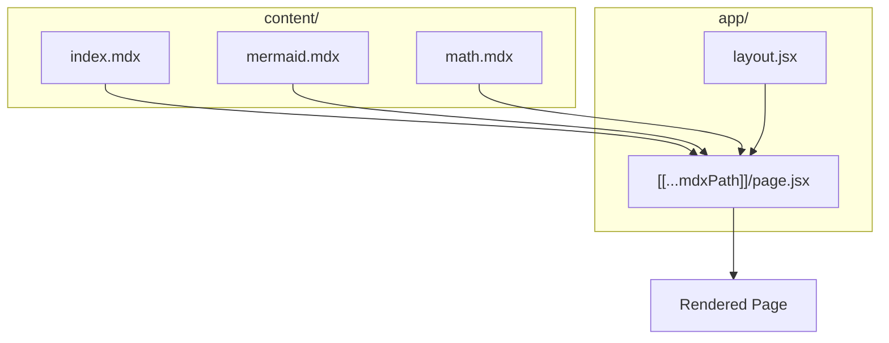

# Mermaid Diagram

This page demonstrates Nextra's built-in [Mermaid](https://mermaid.js.org/) support. Diagrams are authored as fenced code blocks and rendered in the browser.

## Spec-Driven Development Flow

The diagram below shows the Spec-Kit SDD workflow used to build this site:

## Nextra Architecture

[← Back to Home](/)
